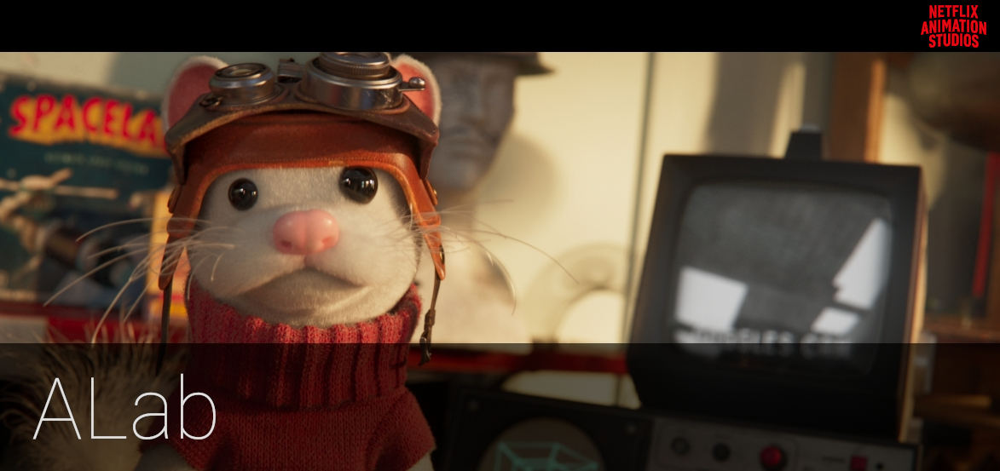

# Introduction

Welcome to Animal Logic's USD [ALab](https://animallogic.com/alab/).

**TL;DR:** [Download ALab](https://dpel.aswf.io/alab/) and open `entry.usda` to get started.

Applications with USD support, such as Maya-2022+, Houdini-18.5+ and many more should be able to load and render the provided assets.

For quick preview and inspection, [`USDView`](https://graphics.pixar.com/usd/docs/USD-Toolset.html#USDToolset-usdview) is a great starting point.

|   Glimpse (AL proprietary)   | Houdini (Karma) |  Maya (VP2/render purpose) |  UsdView (Storm/render purpose)  |
| ---------------------------- | --------------- | ------------------ | ------------------------ |
|||||

# Documentation

- [Documentation](docs/src/pages/documentation.md) - File structure layout and asset documentation.
- [AL-specific content](docs/src/pages/alSpecific.md) - Animal Logic specific concepts, which we love, but had to remove from ALab to ensure ease of use and compatibility.
- [Changelog](docs/src/pages/changelog.md) - List of all the updates from the latest versions of ALab.

# About ALab
The ALab data set is the Animal Logic interpretation and implementation of real-world production and pipeline concepts in USD.

It includes over 300 fully surfaced assets derived from an internally produced project, rather than created from scratch as a "USD reference implementation." It consequently exhibits the complexities (and some of the messiness) of real production assets. If one were to build a USD structure for the sole purpose of showcasing USD, it would lead to a different result.

The `entry.usda` `stage` places you in a shot with a structure similar to how we use it at Animal Logic. Since no shot is complete without animation, included are two animated characters, each with some level of proceduralism. Due to this proceduralism requiring some custom `schemas` for our internal Glimpse renderer, we have provided a hint on what these procedurals create in a separate `baked_procedurals` package. This is the "cached" content that would be sent to the renderer per-frame.

For “production style rendering” we also provide an additional package `texture_pack` with multi UDIM, mipmapped 4K OpenEXR textures.

Refer below to the `Available Packages` section for more information on these.

We hope that this is the starting point for future contributions to showcase new ideas for discussion, promotion, and hopefully adoption.

## Why did Animal Logic create these assets?
We created them to be used *internally*, primarily to provide client-free IP data for:
- Training of Developers, TDs and Artists
- Discussion Reference ("something to point at")
- Production / Stability Testing
- Tool / Unit Testing
- Pipeline Modifications Testing
- Workflow Experiments

## What do we hope you'll do with them?
The same as we do internally. Their intended usage includes, but is not limited to:
- Training and Education (Schools, University, Courses etc)
- Discussion Reference (USD-interest, GitHub issues etc)
- CI/Build Testing (software vendors)
- Feature Testing (software vendors)
- Workflow Experiments and white paper proposals

# Available Packages

As the complete data set is heavy and different use cases may consume distinct subsets of the data, ALab is split in different packages, each serving a different purpose depending on the consuming context.

*If in doubt, start only with the `Asset Structure` and `Techvar Assets` packages.*

## Asset Structure
* Main USD asset structure. No geometry, shaders or lights.

This is purely the asset structure showcasing how all assets relate to each other through USD composition arcs. It does not include any geometry, shaders or lights, but it does include bounding box information and texture cards for every asset to be able to see extents and a preview of the ALab.
Open the `entry.usda` in your application to inspect the content:

Since there are no geometry, shaders or lights in this pacakge, nothing will be visible by default in the viewport. However, if changing the draw mode on a prim like `/root/alab_set01` to `bounds` or `cards`, you'll be able to see a better preview of the contents:

## Techvar Assets
* Geometry, shaders, rigs, lights & 1k textures.

This will allow you to render the ALab *without* fur & cloth. 

Unzip and merge the `fragment` folder from this package onto the `ALab/fragment` folder of the `Asset Structure` package overriding all existing files.

If your application does not set the start and end frame automatically (e.g. when using a `sublayer` node in **Houdini** or Create USD Stage from File in **Maya**), set the frame range from 1004 to 1057.

You can also view through the shot camera on `prim` path: `/root/camera01/GEO/renderCam_hrc/renderCam_buffer/renderCam_srt/renderCam`.

## Baked Procedurals
* Baked procedurals (mainly in the form of `BasisCurves`) for the fur & cloth of the characters.

Internally we use custom schemas which allow procedural expansion of fur & cloth at render time. Since we can not ship these schemas as they are bound to our internal renderer, we provide their "expanded form as USD caches" separately. 

Unzip the contents on top of the default ALab package to merge the `baked_procedurals` folder, overriding the previously empty `baked_procedurals/main.usda` file.

After merging, your contents from the `baked_procedurals` folder should look like below:

## Texture Pack
* 4k texture maps, half float mipmapped OpenEXR images in ACEScg colour space.

We provide the textures to allow for testing of rendering in a more realistic, production-like configuration and encourage the creation of renderer-specific materials.

Move the `fragment` folder from this package onto the `fragment` folder of the vanilla asset package and override all conflicting files, which already exist.

## Trailer Cameras

Unzip the contents on top of the default ALab package to merge the `camera_packages` folder, overriding the previously empty `camera_packages/main.usda` file.

After merging, your contents from the `camera_packages` folder should look like below:

> Note: These cameras are a specially built package and are not representative of the structure used in the pipeline.

All the shot cameras appear in the `stage` under the `prim` `/root/cameras`.

From the **Camera** > **Select Camera** menu, choose the required shot camera.

# Contact & Feedback

We are proud to have been accepted into the [Academy Software Foundation Digital Production Example Library](https://dpel.aswf.io). As such we have moved further conversations to the [#assets-alab](https://academysoftwarefdn.slack.com/channels/C03S4QB8N04) slack channel.
