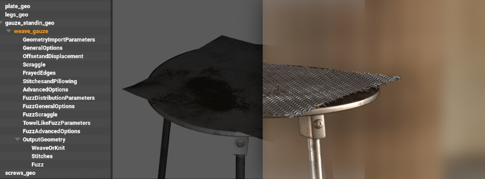

# Animal Logic

This document describes some of the USD concepts, which we love, but had to remove from ALab to ensure ease of use and compatibility. Some of them are more daring and unique than others, but we hope that you find them all interesting.

# toc

# Animal Logic

## URIs > Relative Filepaths

We replaced all URIs, which we use in our assets, with filepaths. Our asset resolver has a tiered plugin system, which allows us to resolve (and even mutate) URIs in multiple different ways. For example, the "STATE" in the URI can be overwritten easily so that a given process can switch between the "delivered" state of an asset and the "live/latest" state.

```c++
subLayers = [
        @ark:/JOB(al_template)/ASSETDIR(assets)/LIBRARY(entity)/ENTITY(furniture_workbench01)/DOMAIN(surfacing)/STATE(delivered)?version=15&extension=.usda:.usd:.usdc@,
        @ark:/JOB(al_template)/ASSETDIR(assets)/LIBRARY(entity)/ENTITY(furniture_workbench01)/DOMAIN(modelling)/STATE(delivered)?version=14&extension=.usda:.usd:.usdc@
    ]
```

## Camera Attributes

The AL Camera `Schema` provides many attributes in addition to the default camera `schema`:

- **`burnIn_` Attributes**: The `attributes` are passed on to the review pipeline and displayed on the "letterbox burnIn." They are primarily driven by requirements of a "plate-based" VFX/hybrid show and display information, which is important in reviews:

```c++
burnIn_enabled
burnIn_frameInsetBotCinema
burnIn_frameInsetBotRender
burnIn_frameInsetLeftCinema
burnIn_frameInsetLeftRender
burnIn_frameInsetRightCinema
burnIn_frameInsetRightRender
burnIn_frameInsetTopCinema
burnIn_frameInsetTopRender
burnIn_hardCodedInnerRatio
burnIn_hardCodedOuterRatio
burnIn_innerRatio
burnIn_outerRatio
burnIn_showInsetCinema
burnIn_showInsetRender
burnIn_showTumbleLines
burnIn_showTumbleSquare
```

- **`al_` Attributes**: Mainly used for "plate-based shows," allows description of real-world cameras, defined by a custom schema:

```c++
[...]
static const TfTokenVector distortAttrsTable[numModels] = {
        // ClassicLDModel
        {
            AL_SchemasCommonTokens->al_distort_enabled,
            AL_SchemasCommonTokens->al_distort_pin_edges,
            AL_SchemasCommonTokens->al_distort_center_x,
            AL_SchemasCommonTokens->al_distort_center_y,
            AL_SchemasCommonTokens->al_distort_distortion,
            AL_SchemasCommonTokens->al_distort_quartic_distortion,
            AL_SchemasCommonTokens->al_distort_curvature_x,
            AL_SchemasCommonTokens->al_distort_curvature_y,
            AL_SchemasCommonTokens->al_distort_anamorphic_squeeze,
            AL_SchemasCommonTokens->al_distort_auto,
            AL_SchemasCommonTokens->al_distort_auto_gain,
            AL_SchemasCommonTokens->al_distort_lens_breathing_multiply
        },

        // RadialStdDeg4
        {
            AL_SchemasCommonTokens->al_distort_enabled,
            AL_SchemasCommonTokens->al_distort_pin_edges,
            AL_SchemasCommonTokens->al_distort_dynamic_lens,
            AL_SchemasCommonTokens->al_distort_center_x,
            AL_SchemasCommonTokens->al_distort_center_y,
            AL_SchemasCommonTokens->al_distort_distortion,
            AL_SchemasCommonTokens->al_distort_u_deg2,
            AL_SchemasCommonTokens->al_distort_v_deg2,
            AL_SchemasCommonTokens->al_distort_quartic_distortion,
            AL_SchemasCommonTokens->al_distort_u_deg4,
            AL_SchemasCommonTokens->al_distort_v_deg4,
            AL_SchemasCommonTokens->al_distort_phi_cylindric_dir,
            AL_SchemasCommonTokens->al_distort_b_cylindric_bending
        },

        // AnamorphicStdDeg4
        {
            AL_SchemasCommonTokens->al_distort_enabled,
            AL_SchemasCommonTokens->al_distort_pin_edges,
            AL_SchemasCommonTokens->al_distort_dynamic_lens,
            AL_SchemasCommonTokens->al_distort_center_x,
            AL_SchemasCommonTokens->al_distort_center_y,
            AL_SchemasCommonTokens->al_distort_cx02,
            AL_SchemasCommonTokens->al_distort_cy02,
            AL_SchemasCommonTokens->al_distort_cx22,
            AL_SchemasCommonTokens->al_distort_cy22,
            AL_SchemasCommonTokens->al_distort_cx04,
            AL_SchemasCommonTokens->al_distort_cy04,
            AL_SchemasCommonTokens->al_distort_cx24,
            AL_SchemasCommonTokens->al_distort_cy24,
            AL_SchemasCommonTokens->al_distort_cx44,
            AL_SchemasCommonTokens->al_distort_cy44,
            AL_SchemasCommonTokens->al_distort_lens_rotation,
            AL_SchemasCommonTokens->al_distort_squeeze_x,
            AL_SchemasCommonTokens->al_distort_squeeze_y
        },

        // AnamorphicDeg6
        {
            AL_SchemasCommonTokens->al_distort_enabled,
            AL_SchemasCommonTokens->al_distort_pin_edges,
            AL_SchemasCommonTokens->al_distort_dynamic_lens,
            AL_SchemasCommonTokens->al_distort_center_x,
            AL_SchemasCommonTokens->al_distort_center_y,
            AL_SchemasCommonTokens->al_distort_cx02,
            AL_SchemasCommonTokens->al_distort_cy02,
            AL_SchemasCommonTokens->al_distort_cx22,
            AL_SchemasCommonTokens->al_distort_cy22,
            AL_SchemasCommonTokens->al_distort_cx04,
            AL_SchemasCommonTokens->al_distort_cy04,
            AL_SchemasCommonTokens->al_distort_cx24,
            AL_SchemasCommonTokens->al_distort_cy24,
            AL_SchemasCommonTokens->al_distort_cx44,
            AL_SchemasCommonTokens->al_distort_cy44,
            AL_SchemasCommonTokens->al_distort_cx06,
            AL_SchemasCommonTokens->al_distort_cy06,
            AL_SchemasCommonTokens->al_distort_cx26,
            AL_SchemasCommonTokens->al_distort_cy26,
            AL_SchemasCommonTokens->al_distort_cx46,
            AL_SchemasCommonTokens->al_distort_cy46,
            AL_SchemasCommonTokens->al_distort_cx66,
            AL_SchemasCommonTokens->al_distort_cy66
        },

        // RadialFisheyeDeg8
        {
            AL_SchemasCommonTokens->al_distort_enabled,
            AL_SchemasCommonTokens->al_distort_pin_edges,
            AL_SchemasCommonTokens->al_distort_dynamic_lens,
            AL_SchemasCommonTokens->al_distort_center_x,
            AL_SchemasCommonTokens->al_distort_center_y,
            AL_SchemasCommonTokens->al_distort_distortion,
            AL_SchemasCommonTokens->al_distort_quartic_distortion,
            AL_SchemasCommonTokens->al_distort_degree6,
            AL_SchemasCommonTokens->al_distort_degree8
        },
}
[...]
```

## Prim Schemas

In addition to the Camera `schema`, we use other `schemas` for various use cases at Animal Logic. See below for a few more examples, which we use with the "USD Schema Generator" (as outlined [here](https://graphics.pixar.com/usd/docs/api/_usd__page__generating_schemas.html)).

```c++
class ALEditFrameRange "ALEditFrameRange" (
    doc = "AL's FrameRange provided by the Edit department"
    inherits = </Typed>
    customData = {
        string className = "EditFrameRange"
        string fileName = "EditFrameRange"
      }
)
{
    int startHeadFrame = -1
    int endTailFrame = -1
    int headFrameCount = -1
    int tailFrameCount = -1
    int render:maxFrameCount = -1
    int render:stepSize = -1
}
```

```c++
class "ALGlimpseCurveAPI"
(
    inherits = </ALGlimpseObjectAPI>
    customData = {
        string apiSchemaType = "nonApplied"
        string className = "GlimpseCurveAPI"
        string fileName = "GlimpseCurveAPI"
        string extraIncludes = """ """
    }
)
{
  token glimpse:curve:renderingMode = "hair" (
    allowedTokens = ["hair", "sausages", "ribbon"]
    customData = {
        string apiName = "renderingMode"
    }
  )

  token glimpse:curve:shadowMode = "opaque" (
    allowedTokens = ["opaque", "transparent"]
    customData = {
        string apiName = "shadowMode"
    }
  )

  int glimpse:curve:subdivision = 0 (
    customData = {
        string apiName = "curveSegmentsSubdiv"
    }
  )

  float glimpse:curve:anisotropy = 0.0(
    customData = {
        string apiName = "normalsAnisotropy"
    }
  )
}
```

## Maya Reference Schema

We use a custom `schema` called `ALMayaReference` to reference Maya data. When shot building tools (`AL_USDMaya`) encounter such a prim during stage traversal, a corresponding reference will be created in the current Maya file. We use this mainly for rigs and "motion" (animation).

```c++
    def ALMayaReference "rig"
    {
        asset mayaReference = @rigs/cache.mb@
    }
```

## Render Procedurals



In the Animal Logic pipeline, we emit some procedural geometry straight into the renderer (Glimpse).

- Cloth and Fabric ("[Weave](https://dl.acm.org/doi/abs/10.1145/3214745.3214781)")
- Hair and Fur ("Alfro")

The procedurals are defined in USD and the renderer translator instantiates them in the render scene. The procedural also receives a `reference` to the [USD _stage ID_](https://graphics.pixar.com/usd/docs/api/class_usd_stage_cache.html), to allow access to the completely composed data in the stage.

In the example below, you can see how the **weave** procedural is configured to read geometry from the `prim` `"../../gauze_standin_geo"`. So when the renderer executes the procedural, the `prim` will be located in the `stage` and the procedural will emit the geometry "on" the gauze mesh in the correct location.

> Note: We will replace the "relative path" string attribute with USD relationships soon.

[weave.usda](./public/weave.usda)

```python
def "weave_gauze" (
    append references = @file://$WEAVE_SUBGRAPHS_PATH/WeaveHoudiniRenderProcedural.usda@
    )
    {
        over "GeometryImportParameters"
        {
            string alf:param:primpathMesh = "../../gauze_standin_geo"
        }
[...]
```

`alfro.usda`

```python
def ALAlfroRoot "alfro_body_main"(
    prepend references = @file://$ALFRO_SUBGRAPH_PATH/AlfroHoudiniRenderProcedural.usda@
    )
    {
        over "GeometryImportParameters"
        {
            string alf:param:primpathRenderCurves = "../curves"
            [...]
        }
        over "RenderParameters"
        {
            string alf:param:curveRenderingMode = "hair"
            [...]
        }

[...]
```

## Surfacing Render Procedurals

Glimpse Materials assigned to Render Procedurals, such as Alfro and Weave, utilze some `primvars` or userdata to add variations in color, length, density, etc.

Some `primvars` used on Alfro and Weave at rendertime are:

- **curveRenderingMode** - Available Options: Hair, Ribbons, Sausages
- **follicleId**, **particleId** & **strandId** - To add variation
- **length** & **width** - Hair/Thread length and width
- **stitchGroupId** - Specific to Weave Stitches

When downloading the `baked_procedurals` additional package, these `primvars` will be present in the `BasisCurves` prims and can be used as userdata to get variations in hair and cloth while creating materials in Arnold / Renderman / Karma.

## "Glimpse" Materials and Bindings

[Glimpse](https://www.fxguide.com/fxfeatured/a-glimpse-at-animal-logic/) is the in-house renderer at Animal Logic.

Layered assignments underpin two important workflows:

- Hierarchy-based material layering to achieve effects, such as rust and dirt
- Assignment hierarchy inferred concatenation of material inputs / outputs as "overrides." This concept is similar to `primvars` as material input overrides, but the `override` values can be computed with shader graphs at render time.

With regards to material composition, we currently leverage referencing in two ways:

- To `reference` materials from a centralised "material library" into "look bindings."
- To `reference` "subgraphs" (node graphs) of shaders into materials. Our "triplanar projection" setup is an example of this.

[look_binding.usda](./public/look_binding.usda)

```c++
    over "GEO"
    {
        rel material:binding:preview = </root/MATERIAL/usdpreviewsurface1>
        custom rel material:slotBinding:_010 = </root/MATERIAL/generic01>

        over "spool_M_geo"
        {
            custom rel material:slotBinding:_000 = </root/MATERIAL/multimetal01>
            custom rel material:slotBinding:_010:_:_000 = </root/MATERIAL/generic01_override>
        }

        over "innerWire_M_geo"
        {
            custom rel material:slotBinding:_000:_:_000 = </root/MATERIAL/generic01_override>
        }

        over "wire_M_geo"
        {
            custom rel material:slotBinding:_000:_:_000 = </root/MATERIAL/generic01_override>
        }
    }
```

## Ptex Asset Attributes

We have extended the `ptex` format slightly to be able to set a per mesh "face index offset." This allows us to use single `ptex` files for multiple mesh `prims`, even if they have overlapping face indexes. Our pipeline will "bake" certain information (such as "occlusion") into `ptex` files and author a corresponding USD `layer` with relevant `attributes`/`primvars`:

```c++
def "root"
{
    string primvars:glimpse:userData:asset_channels_bakeTexture = "ark:/JOB(al_template)/ASSETDIR(assets)/LIBRARY(fragment)/FRAGTYPE(geo)/DOMAIN(modelling)/FRAGMENT(furniture_workbench01)/TECHVAR(baked_data)/ASSET(texture)?version=13&path=asset_channels_bake.ptx"
    string primvars:glimpse:userData:asset_occlusion_bakeTexture = "ark:/JOB(al_template)/ASSETDIR(assets)/LIBRARY(fragment)/FRAGTYPE(geo)/DOMAIN(modelling)/FRAGMENT(furniture_workbench01)/TECHVAR(baked_data)/ASSET(texture)?version=13&path=asset_occlusion_bake.ptx"

    over "GEO"
    {
        over "glassPane_geo"
        {
            int primvars:glimpse:userData:ptexFaceIndexOffset = 0
        }

        over "skirting_geo"
        {
            int primvars:glimpse:userData:ptexFaceIndexOffset = 150
        }

        over "toekicker_geo"
        {
            int primvars:glimpse:userData:ptexFaceIndexOffset = 472
        }

        over "counter_geo"
        {
            int primvars:glimpse:userData:ptexFaceIndexOffset = 1094
        }
    [...]
```

## Variant Fallbacks

`Variant Fallbacks` provide a convenient mechanism to define which `variants` various departments should "see" when loading USD files. Keep in mind that you can set `variant fallbacks` via `pluginInfo.json` files (+environment variables) or as static `attributes` on `stage` objects before you load `layers` into them. This means that you can have company/show/department/shot-specific `fallbacks`. Below is an excerpt of some of our `fallbacks`:

```json
{
    "Plugins": [
        {
            "Type": "resource",
            "Name": "ALUsdVariantFallbacks",
            "Info": {
                "UsdVariantFallbacks": {
                    "alfro": ["render"],
                    "weave": ["render"],
                    "spawn": ["render"],
                    "spruce": ["render"],
                    "quill": ["render"],
                    "geocache": ["animfinal_render_high", "animbase_render_high"],
                    "geo": ["render_high", "display_high"],
                    [...]
                    "simrig": ["shot", "global"],
                    "simcontrol": ["shot", "global"],
                    "simdata": ["shot", "global"]
                }
            }
        }
    ]
}
```

## Models & Custom Kinds

We find that USD newcomers can often find `Models` & `Kinds` a bit confusing, so we extended this description slightly to provide a bit of additional context about them.

### Model Hierarchy

So, what is a `Model`? The term `Model` is probably easiest explained by drawing an analogy to real life toy model kits.

So by declaring certain `prims` as `Models`, later on we can easily run queries such as "which prims in this shot represent models." Models also have other useful properties in USD, such as switches for their "drawmode."

> Note: The (base) `Model` `kind` is not used directly, but rather you'd use the more specific `Assembly`, `Group` or `Component` `kinds`.

### Grammar Matters

Models are organised into "Model Hierarchies" (`Groups` & `Assemblies`).

Be aware that there is a fairly strict "grammar" in USD, which needs to be adhered to when you set up your model hierarchy. If you break it (parent an `assembly` under a `component`), the `modelAPI` won't function as expected (ie, drawmode won't work, etc). In addition, it is important not to use unregistered `kinds` (although the USD API does allow that).

### Register Your Kinds (`pluginInfo.json`)

To register custom `kinds` in your pipeline, define them in a `pluginInfo.json`. This is an excerpt of the one we use at Animal Logic:

```json
{
    "Plugins": [
      {
        "Info": {
          # Any modification to this file should be reflected
          # in the file used to generate the c++ tokens.
          "Kinds": {
              "scene": {
                  "baseKind": "assembly"
              },
              "shot": {
                  "baseKind": "assembly"
              },
              ...
              "environment": {
                "baseKind": "assembly"
              },
              "character_asmb": {
                "baseKind": "assembly"
              },
              "crowd_asmb": {
                "baseKind": "assembly"
              },
              ...
              "part": {
                "baseKind": "component"
              },
              "setpiece": {
                "baseKind": "component"
              },
              "camera": {
                "baseKind": "component"
              },
              "lightrig": {
                "baseKind": "component"
              },
              ...
          }
        },
        ...
    ]
}
```
