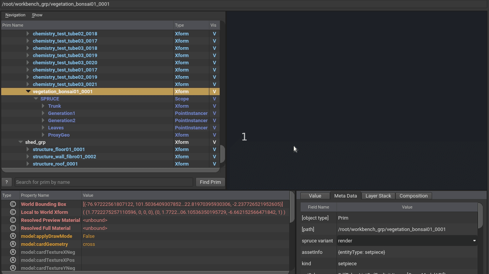

# Documentation

# toc

# Documentation

## File / Asset Structure (Entities & Fragments)

At Animal Logic, we organise files into "`Entities` & `Fragments`" Libraries.

> Note: If we weren't using a custom asset resolver internally, we would probably use two `PXR_AR_DEFAULT_SEARCH_PATH`s (pointing to `/entity` and `/fragment`) to make asset identification very simple.

### Entities

High-level production concepts like **Characters**, **Environments** and **Shots**.


### Fragments

"Data Bundles," such as **Geometry** (with various representations) or **Materials & Textures** (Looks).


### Domain Layers

`Layers` on the `Entities`, which connect the `Fragments` to the `Entities`. Those layers exist for each Pipeline Step (Department).


### Shared Fragments

`Fragments` allow us to re-use data to reduce duplication of assets. For example, we can create **"surfacing variations"** by sharing the same geometry and rig, but using different looks:


### Assemblies & Breakdowns

We connect `Entities` to other `Entities` via the `Assembly` and `Breakdown` `Fragments`.

For an **Environment** `entity` to be populated with **Setpiece** `entities`, we use `Assembly` `fragments`:


At the shot level, the `Breakdown Fragment` brings `entities` such as **Characters**, **Cameras** or **Environments**.

Other `fragments` provide shot-specific `overrides`, for example:

- Lights unique to the shot.
- Simulation caches from **FX**.
- Camera caches from **Layout**.


### Composition Arc Diagrams

Internally, we use more complex diagrams, such as the one below, to describe relationships between the files. We have many diagrams for various composition workflows, such as **Characters**, **Matte Painting** and **Crowds**.


_Open in a new window for details._

### Asset Authoring

The creation of `Entities` and `Fragments` is handled by our internal tool, **Film Studio**.

## Terminology & History

Whilst the terms above could be considered _non-standard_, we note that we're not aware of an agreed-upon industry standard to use in place thereof (ie, even **ftrack** and **ShotGrid** use the term "**Asset**" to describe different concepts).

USD Adoption at Animal Logic initially started in 2017 in animation and was introduced across all departments in 2019.

We started by having versions of our geometry pipeline files encoded in USD (modelling geometry and animation caches), followed by using USD to represent the "relationships between assets" (introduction of `Entities` and `Fragments` pipeline). Then we updated lighting with `USDLux` in a full USD workflow. Then shading workflows to `USDShade`, and some of our previously existing instancing tools with `PointInstancers`.

A recent transition is adopting `USDSkel` for our crowds, charFX and animation library workflows.

The `composition arcs` choices have been driven by a balance between our USD knowledge and how much we can commit to change. We are always exploring ways of making our pipeline more flexible, robust and capable of meeting creative requirements from our shows.

# Demonstrated USD Concepts

## Composition Arcs

This is an overview of some of the USD `composition arcs` we use in these assets. To walk through the examples, make sure to be on the main folder where the downloaded assets exist, e.g.:

```bash
cd ~/Downloads/ALab
```

### Payloads

For data that is potentially "heavy." This data should generally be stored in crate (`.usdc`) files and generally does not refer to other files itself.

Usually, we use `Payloads` within the `Fragment` files. For example, for `books_encyclopedias01`:

```bash
usdview fragment/geo/modelling/books_encyclopedias01/geo_modelling_books_encyclopedias01.usda
```

Scene description data, such as `variants`, `extentsHints` or `model kinds` are kept "outside" the `payloads` so that they are available even when `payloads` are not loaded.

```c++
variantSet "geo" = {
    "base" {
        float3[] extentsHint = [(-6.79881, -0.040903993, -7.7824764), (7.272438, 18.345064, 6.9421234)]

        over "GEO" (
            payload = @base/mesh/geo_modelling_books_encyclopedias01_base_mesh_v010.usdc@
        )
        {
        }
    }
```

We split each `variant` into a different `payload` file, since those are usually created at different times in our pipeline, and some might depend on each other. For example, the `display_high` payload is automatically created in **Houdini** once a `render_high` payload is published from **Maya**.

### VariantSets

Different workflows require different representations of the same data. We allow different clients to choose the most appropriate by exposing all possible representations via `variantSets`.

On the fragment `books_encyclopedias01`:

```bash
usdview fragment/geo/modelling/books_encyclopedias01/geo_modelling_books_encyclopedias01.usda
```

We can find several variants for the `geo` `variantSet`:

```c++
def Xform "root" (
    prepend variantSets = "geo"
)
{
    ...
    variantSet "geo" = {
        "base" {
            float3[] extentsHint = [(-6.79881, -0.040903993, -7.7824764), (7.272438, 18.345064, 6.9421234)]

            over "GEO" (
                payload = @base/mesh/geo_modelling_books_encyclopedias01_base_mesh.usdc@
            )
            {
            }
        }
        "client_model" {
        }
        ...
        "render_high" (
            variants = {
                string geo_vis = "preview"
            }
            prepend variantSets = "geo_vis"
        ) {
        ...
}
```

Some `variants` exist only because we create the USD files from templates. In the future, we aim to improve the USD generation workflows to author only what is needed on a case-by-case basis, so we would not see empty "**client_model**" or "**muscles**" `variants`, unless required.

To know more about our `variants` in the pipeline, visit the [Variants](#variants) section.

### References

`References` are like `payloads`, but "always loaded." We use `references` to bring `Fragments` into `Domain Layers`.

For example, the Modelling `Layer` on prop `books_encyclopedias01` `references` a geo `fragment`:

```bash
usdview entity/books_encyclopedias01/modelling/books_encyclopedias01_modelling.usda
```

We could have also used `sublayers` in many cases to achieve similar results as we usually `reference` the **root** `prim`.

```c++
def "root" (
    prepend references = @../../../fragment/geo/modelling/books_encyclopedias01/geo_modelling_books_encyclopedias01.usda@
)
```

This is a scenario where "what arc to use" was driven by a historical technical reason. In this case, our geometry pipeline I/O required DCCs to refer to a "single root Xform" for the geometry files. Choosing `sublayers` instead required updates to our legacy pipeline, which we did not want to commit to do.

When more `domains` started transitioning to USD, most followed the `reference` approach for the sake of consistency. But, in cases where a `sublayer` or another `arc` solved a particular workflow, those deviations are embraced. For example, on shots, our **fxcache** `fragments` are `sublayered` and not `referenced`.

### Sublayers

`Sublayers` are mainly used in our assets to add `Domain Layers` (departments or pipeline steps) to `entities`. For example, for the entity `books_encyclopedias01`, we have:

```bash
usdview entity/books_encyclopedias01/books_encyclopedias01.usda
```

```c++
    subLayers = [
        @surfacing/books_encyclopedias01_surfacing.usda@,
        @modelling/books_encyclopedias01_modelling.usda@
    ]
```

Some `Domain Layers` have additional "**subdomain**" layers. For example, **animbase** and **animfxcache** subdomains are `sublayers` of the **animation** domain. We do this because our "department delivery" mechanism is tied to `domains` and animation needs to iterate internally on the subdomain before delivering the animation `domain` for downstream consumption.

Additionally, some `fragments` may be `sublayered` like the **animfxcache** and **charfxcache** ones, as can be seen on the provided shot **mk020_0281**:

```bash
usdview entity/mk020_0281/charfxcache
```

```c++
    subLayers = [
        @../../../fragment/fxcache/animfxcache/stoat_geo/mk020_0281_fxcache_animfxcache_stoat_geo.usda@,
        @../../../fragment/fxcache/animfxcache/stoat_alfro/mk020_0281_fxcache_animfxcache_stoat_alfro.usda@,
        @../../../fragment/fxcache/animfxcache/remi_geo/mk020_0281_fxcache_animfxcache_remi_geo.usda@
    ]
```

This decision came mainly from FX workflows, where a single FX fragment would theoretically be able to `override` any `prim` in a shot. Plus, the added convenience for ensuring their contributions are "stronger" than any previous department providing imageable `prims`.

### Specializes

We use the `Specializes` `arc` in a very different way to the other ones and for a very specific reason.

It ensures that the **root** `prim` of our entities has a type (`Scope`), while allowing `domains` to `override` it with a more appropriate type (e.g. `Xform` by modelling or `SkelRoot` by rigging for characters with `USDSkel`) via their `referenced` `fragments`.

In other words, an `opinion`, which is contributed via some complex composition arc (`variant` within a `reference` within a `sublayer`), needs to bring an `opinion`, which is stronger than the "local" `opinion`. So we consulted [LIVRPS](https://graphics.pixar.com/usd/docs/USD-Glossary.html#USDGlossary-LIVRPSStrengthOrdering) and chose the arc with the weakest strength to set the type. Now, we can just reference a rig `fragment` into the rigging `layer` of an `entity` and the **root** `prim` will change its type to **skelRoot**.

On the entity `books_encyclopedias01`:

```bash
usdview entity/books_encyclopedias01/books_encyclopedias01.usda
```

```c++
def "root" (
    ...
    prepend specializes = </_root_type>
)
{
}

class Scope "_root_type" (
    doc = "This prim holds the 'fallback' type of the default root prim"
)
{
}

```

We ensure the specialized **\_root_type** `prim` is a `class` to let most workflows know they can "ignore it" for their common traversals.

## Purposes

The assets utilize USD `purposes` to switch between a lower resolution for OpenGL/viewport display and higher resolution for rendering. This means that users should only have to switch the `purpose` in the delegates' settings and should not have to switch variants.

Please see the section on [UsdPreviewSurface Materials](#usdpreviewsurface-materials-and-textures) below for more information.


### Display Colors and Opacity Colors

Animation and other shot departments often need to commence work on assets before they are surfaced.

We author **displayColor** and **displayOpacity** `attributes` in the Modelling department in Maya for this purpose.

Later on, when surfacing starts to supply materials, they will supersede the display colors and textures will appear in the viewport.

## Variants

Each of the published `entities` (characters, props, environments) exposes `variantSets` on the default `prim` (e.g. **geo**, **geocache**, **camera**, **skeleton**, **alfro**, **weave**).

This allows consumers of those `entities` (mainly shot departments), to safely make `variant` selections on those root `prims` directly.

One nice aspect of `variants` is that there is a `fallback` mechanism that can be set programmatically when opening `stages` or via a plugin on the environment. We use both in our pipeline and this means we never publish characters, props or environments with internal `variant` selections. We always defer those selections to consumers of the `entities` via the mentioned mechanisms.

> Note: We used to have **look** set with `render_high` and `display_high` `variants`, but dropped it since we started authoring both preview and final render `opinions` on the same "look" asset. <br><br> Since this started happening in the middle of a production, the main asset location remained `render_high`. So these look `fragments` contain both "render" and "preview" shaders even though the filenames are `render_high`.

## Geo Variants

All our geometry contributions (mainly coming from the Modelling domain), expose different representations of the same data for different consumers.

We provide 2 `variant sets`: **geo** and **geo_vis**.

### Geo Variant Set

| Variant      | Usage                                                                                                                                                                                                                                   |
| ------------ | --------------------------------------------------------------------------------------------------------------------------------------------------------------------------------------------------------------------------------------- |
| base         | All of the geometry, with the exception of blendshape targets, that **modelling** artists author for downstream departments.                                                                                                            |
| render_high  | The main `variant` used for **surfacing** and **shot** departments for high-quality final frame rendering.                                                                                                                              |
| deform_high  | The `variant` used by the **rigging** department to apply deformations. The output of that deformation gets "merged" on shots with the **render_high** geo `variant`.                                                                   |
| display_high | Procedurally created low resolution version of the **render_high** geometry for fast preview while still retaining overall shape and colors.                                                                                            |
| pose         | Mainly used by **modelling** for reviews where the character needs to be in a non-bind pose (e.g. relaxed, with style). This allows for **modelling** to not have to wait for **rigging** to see the character with an expressive pose. |
| shapes_high  | All blendshape targets used by the performance rig, as well as for blendshapes in **render_high**, **deform_high**, **pose** `variants`' creation.                                                                                      |
| client_model | When projects have incoming data from external clients, this is where that client version can be found.                                                                                                                                 |

These `variants` in our pipeline shine with rigged `entities` (characters, props) and we're excited to share some more examples in the future.

#### Pose Variant Example

When modelling creates the **base** geometry, they can also provide a **pose** version for it, which will only override the **points** `property`:

```bash
usdview fragment/geo/modelling/books_encyclopedias01/pose/mesh/geo_modelling_books_encyclopedias01_pose_mesh.usdc
```

This will `sublayer` the **render_high** version and only `override` **points** `properties`:

```c++
#usda 1.0
(
    defaultPrim = "GEO"
    subLayers = [
        @../../render_high/mesh/geo_modelling_books_encyclopedias01_render_high_mesh.usdc@
    ]
)

over "GEO"
{
    over "encyclopedia_01"
    {
        over "encyclopedia1_cover_M_geo"
        {
            point3f[] points = [(-6.766857, -0.01848345, -5.47812), ..., (5.8743553, 18.286024, -5.140335)]
        }

        over "encyclopedia6_cover_M_geo"
        {
            point3f[] points = [(-6.6372204, 0.0063685314, 6.9421234), ..., (5.99792, 18.313019, 6.507246)]
        }
    }
}
```

This allows workflows to switch to the **pose** `variant` while retaining all **render_high** `attributes` like **pref**, **displayColor** and **st**.

We use this mainly for situations where we want to preview the entities with a bit of _personality_ with the official geometry and before rigging and animation have worked on it.

### Geo Vis Variant Set

This provides clients flexibility to switch visibility level between the **render** and **proxy** purposes on a per-entity level.

| Variant | Usage                                                                                                |
| ------- | ---------------------------------------------------------------------------------------------------- |
| default | Leave the **render_high** `variant` as it came from modelling.                                       |
| preview | Use the **display_high** `variant` as a proxy of the **render_high** and set purposes appropriately. |

For example, an artist on a shot with a big environment might want to see on the viewport the "high-res" geometry version of a setpiece to interact with a character.

They can switch that setpiece to `geo_vis=default` to remove any **render** and **proxy** `purpose` `opinions`, while still being on the **render_high** `variant`.


## ExtentsHint & Payloads

When packaging, we compute extents for all geo `fragments`. This applies at the shot level as well, so you can have animated `extentsHint` `properties`.

This allows for unloaded `stages` to provide a preview of all bounding boxes in a shot, allowing for processes like frustum culling.

We `payload` all heavy data behind `fragments` as described on the [Composition Arcs](#composition-arcs) section.

## Camera Domain Variants

USD's `composition` of multiple `opinions` from different `layers` onto the same `prim` is usually desired. For example, a charFX layer might contribute a point `attribute` on a cloth `prim`, which overrides the point `attribute`, which animation has contributed.

However, on cameras, we decided that we usually don't want to `over` `opinions` from the contributing departments (layout and animation), but prefer to see either one _or_ the other. So cameras provide a "domain `variant`," which allows the user to switch between the cameras authored by layout and animation.

## Point Instancer

Previously, we used in-house procedurals for `instancing` elements of **environments** (e.g. vegetation in a forest) as well as instancing elements of the vegetation (e.g. leaves, twigs, branches of trees).

We have updated those workflows to author native USD `Point Instancers` instead, which still give the ability of having nested instancing, plus give the benefit of multi-DCC support and the rest of the USD `composition arcs`.

You can find the `point instancer` under:

```bash
usdview fragment/spruce/modelling/vegetation_bonsai01/spruce_modelling_vegetation_bonsai01.usda
```

Or, with the lab opened, it is on `prim` at path:

```bash
/root/workbench_grp/vegetation_bonsai01_0001
```

The `point instancers` come with **off** and **render** `variants` under the `variant sets` **spruce** and **spawn**.



## USDSkel

[USDSkel](https://graphics.pixar.com/usd/release/api/usd_skel_page_front.html) is a bare-bones rig with simple skeletons and blendshapes. At Animal Logic, `USDSkel` is used for crowd workflows. It works well for this purpose as it is designed to be efficient and scalable, with a lack of shared joint influence and the ability to apply unique animations to `instances` without deinstancing.

This is represented in USD through **skel** `primvars`, which are a part of USD's `SkelBindingAPI`.

```bash
fragment/perfrig/rigging/stoat01/base/rig/perfrig_rigging_stoat01_base_rig/skeleton/FX_skeleton.usdc
```

```c++
...
over "body_M_geo" (
        prepend apiSchemas = ["SkelBindingAPI"]
    )
    {
        matrix4d primvars:skel:geomBindTransform = ( (1, 0, 0, 0), (0, 1, 0, 0), (0, 0, 1, 0), (0, 0, 0, 1) )
        int[] primvars:skel:jointIndices = << int[136160] >> (
            elementSize = 10
            interpolation = "vertex"
        )
        float[] primvars:skel:jointWeights = << float[136160] >> (
            elementSize = 10
            interpolation = "vertex"
        )
        uniform token[] skel:blendShapes
        uniform token[] skel:joints = << TfToken[38] >>
        rel skel:skeleton = </root/RIG/root_jnt>
    }
...
```

This skeleton is exposed under a **skeleton** `variantSet` via the `rig.usda` layer:

```bash
usdview fragment/perfrig/rigging/stoat01/base/rig/perfrig_rigging_stoat01_base_rig/rig.usda
```

```c++
def "root" (
    prepend variantSets = "skeleton"
)
{
    variantSet "skeleton" = {
        "off" {
        }
        "on" (
            payload = @skeleton/FX_skeleton.usdc@
            variants = {
                string geo_vis = "default"
            }
        ) {

        }
    }
}
```

When crowd departments use this as an agent, they choose the `skeleton=on` variant.

## Primvars

`Primvars` are a special attribute that a renderer can associate with a geometric `primitive`. They can vary across the `primitive` they are defined on through various interpolation rules, defined in the [documentation](https://graphics.pixar.com/usd/dev/api/class_usd_geom_primvar.html).

For example, **vertex** defines the value to be interpolated across the vertices on the surface. `Primvars` can also be passed onto children of USD `primitives`. This makes them very flexible, which makes them effective as custom attributes for renderers (such as Animal Logic's Glimpse) to read. You can read more about this in the [AL-Specific documentation](alSpecific).

As seen in the USD snippet above, the `SkelBindingAPI` uses its **skel** `primvars` to allow joint weights and joint indices to vary across the same primitive with vertex interpolation.

One other `primvar` to note is the **st** `primvar`, which is how UVs are represented in Pixar's USD. To work with them in DCCs like Houdini or Maya, they may need to be converted to **uv**. This can be seen when bringing something to SOPs from Houdini's LOPs context through a **sopmodify** node, which includes a toggle to "Translate ST `primvar` to UV."

## Geocache

Once characters or props are animated, the full animated geometry definition is stored on the **geocache** fragment.

The animation is represented through the time-sampled `attributes` in USD, including **extent**, **normals**, **points**, **orientation**, **scale**, and **translation**.

You can find this in the `fragment/geocache` folder, under either **animbase** or **layout** domain folders. These are also exposed as `variant sets`: **animbase** for the final animation, and **layout** for the general blocking.

In USD, the **geocache** heavy data is captured in the `payload.usdc` layer like:

```bash
usdview fragment/geocache/layout/stoat/render_high/cache/mk020_0281_geocache_layout_stoat_render_high_cache/payload.usdc
```

```c++
...
def Mesh "washer02_M_geo"
    {
        float3[] extent = [(-2.0686953, 9.217466, 6.9767714), (-1.9139013, 9.368373, 7.0265174)]
        float3[] extent.timeSamples = {
            << 327 samples in [947, 1273] >>
        }
        ...
        normal3f[] normals = << GfVec3f[195] >>
        normal3f[] normals.timeSamples = {
            << 327 samples in [947, 1273] >>
        }
        point3f[] points = << GfVec3f[195] >>
        point3f[] points.timeSamples = {
            << 327 samples in [947, 1273] >>
        }
        ...
        quatf xformOp:orient:orient.timeSamples = {
            << 327 samples in [947, 1273] >>
        }
        float3 xformOp:scale = (1, 1, 1)
        float3 xformOp:scale.timeSamples = {
            << 327 samples in [947, 1273] >>
        }
        double3 xformOp:translate = (0, 0, 0)
        double3 xformOp:translate.timeSamples = {
            << 327 samples in [947, 1273] >>
        }
        uniform token[] xformOpOrder = ["xformOp:translate", "xformOp:orient:orient", "xformOp:scale"]
    }
```

Exposed under a **geocache** `variant set`, which `payloads` the data under the `geo=render_high` `variant` on the `cache.usda` `layer`:

```c++
over "root" (
    variants = {
        string geocache = "animbase_render_high"
    }
    prepend variantSets = "geocache"
)
{
    variantSet "geocache" = {
        "animbase_render_high" (
            variants = {
                string geo = "render_high"
            }
            prepend variantSets = "geo"
        ) {
            variantSet "geo" = {
                "render_high" (
                    payload = @payload.usdc@
                ) {
                }
```

This way, at any point one can pick different per-department animated contributions (for example, **layout** and **animation**).

Since the introduction of `USDSkel`, whenever the **skeleton** `variant` exists in our characters, at **geocache** creation time an additional **skeleton** techvar cache is created:

```bash
usdview fragment/geocache/animbase/stoat/skeleton/cache/mk020_0281_geocache_animbase_stoat_skeleton_cache/payload.usdc
```

```c++
over "root"
{
    custom string assetVersionId = "1714672323"

    over "RIG"
    {
        over "Animation"
        {
            token[] joints = << TfToken[44] >>
            quatf[] rotations = << GfQuatf[44] >>
            quatf[] rotations.timeSamples = {
                << 327 samples in [947, 1273] >>
            }
            half3[] scales = << GfVec3h[44] >>
            float3[] translations = << GfVec3f[44] >>
            float3[] translations.timeSamples = {
                << 327 samples in [947, 1273] >>
            }
```

This is exposed as a `variantSet` similar to the **render_high** techvar:

```c++
over "root" (
    variants = {
        string geocache = "animbase_render_high"
    }
    prepend variantSets = "geocache"
)
{
    variantSet "geocache" = {
        "animbase_skeleton" (
            variants = {
                string skeleton = "on"
            }
            prepend variantSets = "skeleton"
        ) {
            variantSet "skeleton" = {
                "on" (
                    payload = @payload.usdc@
                ) {
                }
```

The existence of this `variant` allows our crowd workflows to pick any contribution from animation as "clip" data for the crowd agents.

## CharFXCache

The charFX cache is the result of simulation (done by the charFX team), which runs for resolving collision or dynamics (for example, between cloth and skin). It is usually a `value clip` containing minimal data, such as point positions, but it may also include topology data if the meshes or curves are increased in resolution whilst simulated.

In terms of the USD structure, the "heavy" simulated data is stored in chunks for one or more frames. For example:

```bash
fragment/fxcache/charfxcache/stoat_alfro/base/cache/mk020_0281_fxcache_charfxcache_stoat_alfro_base_cache/payload/animated_data.1004.usdc
```

This will mainly include the animated (and sometimes redefined, when subdivided) properties of the simulated prims:

```c++
        over "alfro_tail_main"
            ...
            {
                def BasisCurves "curves"
                {
                    ...
                    int[] curveVertexCounts = << int[1652] >>
                    float3[] extent.timeSamples = {
                        1004: [(8.048013, 0.5993955, -13.944824), (18.102667, 10.497459, -1.5134108)],
                    }
                    point3f[] points (
                        interpolation = "vertex"
                    )
```

These chunked files are aggregated together via a `value clip` with the `clip.usda`, `clip.manifest.usda` and `clip.topology.usda` files:

```c++
    over "GEO" (
        clips = {
            dictionary alfro = {
                double2[] active = [(1004, 0), ..., (1057, 53)]
                asset[] assetPaths = [
                    @payload/animated_data.1004.usdc@,
                    ...,
                    @payload/animated_data.1057.usdc@
                ]
                asset manifestAssetPath = @./clip.manifest.usda@
                string primPath = "/root/stoat/body_M_hrc/GEO"
                double2[] times = []
            }
```

These are then `payloaded` in the `cache.usda` file:

```c++
        over "body_M_hrc" (
            append variantSets = "geo"
        )
        {
            variantSet "geo" = {
                "render_high" {
                    over "GEO" (
                        prepend payload = @./clip.usda@</root/stoat/body_M_hrc/GEO>
                    )
                    {
                    }
```

The `animfxcache` fragment is fairly the same as `charfxcache`, with the difference being that `animfxcache` runs automatically when a character has has a global FX rig ready to run without human intervention on shots.

For more information on bringing `value clips` together, see [Sequencable, Re-timable Animated "Value Clips"](https://graphics.pixar.com/usd/release/api/_usd__page__value_clips.html) and the [usdstitchclips](https://graphics.pixar.com/usd/release/api/_usd__page__value_clips.html) command line tool.

## Cameras & Frame Range

We provide the cached camera of the shot, which has a frame range of:

- **Start Frame**: 1004
- **End Frame**: 1057

## Value Clip & "Keep Alive"

In the given scene, the bonsai entity: **vegetation_bonsai01** provides "keep alive" behaviour. This means that it has a "loopable" animation on the instances, which makes it come to life.

We achieve this via `value clips` in USD on `spruce_modelling_vegetation_bonsai01_base_groom`:

```bash
usdview fragment/spruce/modelling/vegetation_bonsai01/base/groom/spruce_modelling_vegetation_bonsai01_base_groom/groom.usda
```

```c++
(
    ...
    defaultPrim = "root"
    endTimeCode = 100
    framesPerSecond = 24
    metersPerUnit = 1
    startTimeCode = 1
    subLayers = [
        @clip.usda@,
        @payload.usdc@
    ]
    timeCodesPerSecond = 24
)
```

This `sublayers` `clip.usda`, where we can see the clip data:

```c++
over "root" (
    clips = {
        dictionary default = {
            double2[] active = [(1, 0), (100, 0), ..., (5000, 0)]
            asset[] assetPaths = [@payload.usdc@]
            string primPath = "/root"
            double2[] times = [(1, 1), (100, 100), ..., (5000, 51)]
        }
    ...
```

In phase 2, you can also see a `value clip` used for the baked procedurals of McFerretson's fur.

`Value clips` allow **timesampled animation** to be assembled from a variety of sources, which is effective for scalability. To learn more about `value clips` you can visit [Pixar's Docs](https://graphics.pixar.com/usd/docs/api/_usd__page__value_clips.html).

## Assemblies & Native Instancing

At Animal Logic we make heavy use of instancing whenever possible. By default, all `entities` used on an environment are instanced.

This means if we use the same seven windows on a city, they all share the same prototype `prim`. ALab is no exception, these are the most frequently used `entities` (all of which are instanced):

| Entity                  | Instance Count |
| ----------------------- | :------------: |
| chemistry_test_tube03   |       21       |
| chemistry_test_tube02   |       18       |
| chemistry_test_tube01   |       17       |
| chemistry_bottle03      |       10       |
| chemistry_beaker_rack01 |       8        |

```
usdview fragment/assembly/modelling/thelab01/assembly_modelling_thelab01.usda
```

Key observations:

1. Instancing is currently set on the "referencing" `prim` - on the component (`entity`) root by setting `instanceable = true`.
2. `Overrides` are applied on the same `prim`.
3. It would be very interesting to experiment with different `instancing` layouts, such as `instancing` the geo scopes and the materials.

```c++
        def Xform "chemistry_test_tube03_0001" (
            instanceable = true
            prepend references = @../../../../entity/chemistry_test_tube03/chemistry_test_tube03.usda@
        )
        {
            ... # transformation overrides
        }
        def Xform "chemistry_test_tube03_0002" (
            instanceable = true
            prepend references = @../../../../entity/chemistry_test_tube03/chemistry_test_tube03.usda@
        )
        {
            ... # transformation overrides
        }
```

## UsdPreviewSurface Materials and Textures

```bash
usdview fragment/look/surfacing/decor_tripod_tabletop01/render_high/binding/look_surfacing_decor_tripod_tabletop01_render_high_binding/render_high.usda
```

### Display Purpose: Proxy

Geo with **proxy** display `purpose` utilizes simplified UVs **primvars:st** and a material **usd_proxy** parameterised with BaseColor texture baked from the highres texture to 512x512px jpeg.


### Display Purpose: Render

Geo with **render** `purpose` utilizes two UV sets:

- **primvars:perfuv** - Simplified UVs used for **preview** material binding.
- **primvars:st** - Original UDIM based UVs used for **full** material binding.

#### Preview Material Binding

`usd_preview` material is bound to the prims via `material:binding:preview` binding and the material is parameterised with a single UDIM `BaseColor` and `Opacity` jpeg 1k textures, which seem to work well for opaque and transparent objects' viewport display.

Textures are in OCIO: Utility - sRGB - Texture.


#### Full Material Binding

**usd_full** material is bound to `prims` via **material:binding:full** binding and the materials are parameterized with multi-UDIM 1k half float mip-mapped OpenEXR images in ACEScg colour space.


> Note: We also provide an additional set of higher resolution textures (4k) to simulate more real-world "production rendering." It can be downloaded from [ALab Downloads](https://dpel.aswf.io/alab/).

## Lights

The final-quality production light rig used for Glimpse renders has been included, and has been automatically adapted for closer compliance to `UsdLux` conventions.

Internally, the lighting layer is generated by our procedural USD-authoring system, [Grip](https://dl.acm.org/doi/10.1145/3388767.3407350).

On the provided scene, the main lights are located under the `/root/lightrig01` `prim`, and a few "asset light rigs" can be found under the hierarchy of selected assets, such as the oscilloscope. Shadow-linking exclusions are used for the windows and skydome prims, and some light-linking is used on the asset rigs. Light filters (such as blockers) are not used. Several different light types are used including `DomeLight`, `DistantLight`, `RectLight`, `DiskLight`, `SphereLight` and `CylinderLight`.

A `class` `inherits` arc is used to apply the same light rig to multiple `instances` of assets without breaking instancing, e.g. the **portable_tv.** `prims`.

> Note: When you open the scene in `USDView`, you may get some warnings stating that there is no support for the following primtypes in hydra storm renderer: `CylinderLight`, `DiskLight` and `DistantLight`.

## Render Procedurals as Curves

Render procedurals such as hair (Alfro) and cloth (Weave) have been expanded into the thousands of curves that their Glimpse-specific render procedural USD data represents. This way they can also be rendered by your renderer. Their original proxy geometry remains, with their UVs transferred onto the curves so they can be textured.


These curves are represented by USD overrides and stored in `baked_procedurals.usd`. They overwrite the original Animal Logic procedural data designed for Glimpse with a `prim` `<procedural_root_prim>/procedurals/output/curves`.

These curves should be visible by switching to a view with display `purpose` **render**. In `USDView`, you can navigate to **View > Display Purposes > Render**.

> Note: Textures are not visible on curves in `USDView` - the above image was rendered in Houdini's Karma renderer.

## Texture Cards in Draw Mode

The ability to set entities draw mode to **card** drastically increases viewport performance. Global entities of `component` `Kind` have textures for "cards" Draw Mode.

For cards Draw Mode to work, we need to have a few `attributes` authored:

- **model.applyDrawMode**: Suggests at what level the Draw Mode will be applied. A value of **True** means that an assembly will be set as a whole. A value of **False** will overwrite this.

- **model.cardGeometry**: Dictates the type of cards to use. Default is **box**.

- **model.cardTexture(XYZ)(PosNeg)**: Texture path values that are used to generate the actual cards. If no values are set, a card won’t be drawn. If a card value is given a positive, but not a negative, then it will only use one side.

- **model.drawMode**: This is the Draw Mode that needs to be selected. To use this, set the **drawMode** to **cards**.


