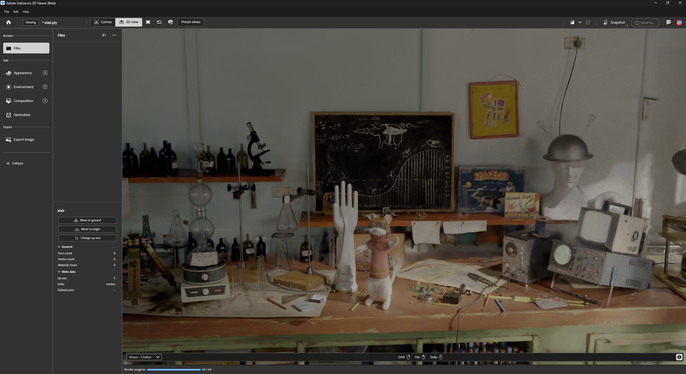

# ALab Splat Pack Documentation

This is the initial version of the ALab as gaussian splats, to help test and preview of PixarAnimationStudios/OpenUSD#3716

It's still a WIP but we wanted to make this available for early testers and hopefully as a tool to help refine the splat schema work.
If you're interested in getting involved with the development of the schema, you should join the [AOUSD Emerging Geometry Interest Group](https://aousd.org/community/interest-groups/#:~:text=VIEW%20CHARTER-,USD%20Emerging%20Geometry,-The%20USD%20Emerging)

## Steps to view the ALab Splat in usdview

1. Build USD from the branch PR: APPLE: Add Gaussian Splats API schema PixarAnimationStudios/OpenUSD#3716
		
		git clone -b gaussians https://github.com/dgovil/USD.git

2. Ensure the PXR_PLUGINPATH_NAME is extended to include 

		share/usd/examples/plugin/hdParticleField/resources/plugInfo.json

3. Clone this ALab branch

4. The alab.usdc will have contents like this:

		def ParticleField_3DGaussianSplat "alab"
		{
		    float3[] extent = [(-4.2353315, -4.928282, -4.960755), (4.912536, 1.9337461, 1.628153)]
		    float[] opacities = << float[1502196] >>
		    quatf[] orientations = << GfQuatf[1502196] >>
		    point3f[] positions = << GfVec3f[1502196] >>
		    float3[] radiance:sphericalHarmonicsCoefficients = << GfVec3f[24035136] >> (
		        elementSize = 16
		        interpolation = "vertex"
		    )
		    uniform int radiance:sphericalHarmonicsDegree = 3
		    float3[] scales = << GfVec3f[1502196] >>
		}
    
5. Launch USDView and set the renderer to hdParticleField
		
    usdview ALab/ALab/extras/gaussian_splats_with_camera.usda

Now you should be able to open it in usdview like this:

## Here's the Splat in some other DCC

### Adobe Substance Viewer (Beta - 0.25.1)

### Nuke 17 beta

### Houdini 21 beta

## How was the first version of the splat created?

1. Used Houdini to do a quick ray cast setup test to try and define enough cameras to capture the majority of the scene (ending up with 570~ frames)
2. Rendered 1k*1k squares of the ALab using Glimpse (NAS's proprietary renderer) with those cameras as linear ACES P3
3. Converted these into .png in a sdr range (at the time this was COLMAP constraint)
4. Fed these into COLMAP to quickly get an input data format that would work with existing gsplat implementations
5. Used nerfstudio/gsplat implementation of 3dgs to splat with pretty standard settings for 30000 steps
6. The result of that training produces the original .ply file

## Future plans

1. The lightrig used for this splat isn't publicly available, so we're considering the best way forward.
2. We will be re-rendering and re-splatting at higher resolution once we decide on the lightrig to use
3. COLMAP was just a shortcut at the time, but we will be taking that out of the workflow eventually, which means you wouldn't need the transform adjustments in the usda
4. Ongoing work to decide the best production workflow colorspace to train splats in. For now we train on linear images with values between 0-1.
5. Splatting with different shape kernels, e.g. 2dgs, and triangles
6. Splatting with different falloffs besides gaussian
7. Animated Splats of Remi and the Stoat
8. Improve camera coverage for the hard to reach spots in the scene

