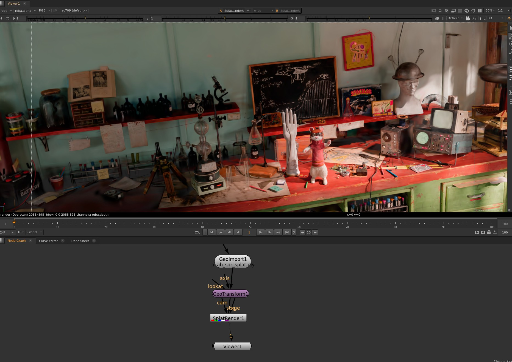
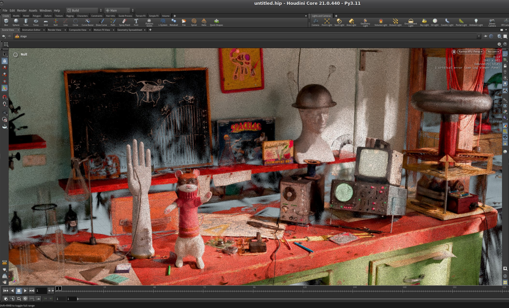

# ALab Splat Pack Documentation

This is the initial version of the ALab as gaussian splats, to help support development and adoption of gaussian splats in USD.

The particleField UsdVol schema has now been merged into the dev branch, and will be available with USD 26.3

We wanted to make this available for early testers and hopefully as a tool to help refine the splat schema work.
If you're interested in getting involved with the development of the schema, you should join the [AOUSD Emerging Geometry Interest Group](https://aousd.org/community/interest-groups/#:~:text=VIEW%20CHARTER-,USD%20Emerging%20Geometry,-The%20USD%20Emerging)

#### Note: you will need to install the adobe usd file format plugins to be able to load .ply files
https://github.com/adobe/USD-Fileformat-plugins

## Steps to view the ALab usdc splat in usdview

1. Build the USD from the dev branch or USD 26.3
		
		https://github.com/PixarAnimationStudios/OpenUSD/tree/dev

2. Ensure the PXR_PLUGINPATH_NAME is extended to include 

		share/usd/examples/plugin/hdParticleField/resources/plugInfo.json

3. Clone this ALab branch

4. The alab.usdc will have contents like this:

		def ParticleField_3DGaussianSplat "alab"
		{
		    float3[] extent = [(-4.2353315, -4.928282, -4.960755), (4.912536, 1.9337461, 1.628153)]
		    float[] opacities = << float[1502196] >>
		    quatf[] orientations = << GfQuatf[1502196] >>
		    point3f[] positions = << GfVec3f[1502196] >>
		    float3[] radiance:sphericalHarmonicsCoefficients = << GfVec3f[24035136] >> (
		        elementSize = 16
		        interpolation = "vertex"
		    )
		    uniform int radiance:sphericalHarmonicsDegree = 3
		    float3[] scales = << GfVec3f[1502196] >>
		}
    
5. Launch USDView and set the renderer to hdParticleField
		
    usdview ALab/ALab/extras/gaussian_splats_with_camera.usda

Now you should be able to open it in usdview like this:

## Here's the SDR Splat in some other DCC

### Nuke 17 beta

### Houdini 21 beta

## How was the first version of the splat created?

1. Used Houdini to do a quick ray cast setup test to try and define enough cameras to capture the majority of the scene (ending up with 570~ frames)
2. Rendered 1k*1k squares of the ALab using Glimpse (NAS's proprietary renderer) with those cameras- these files were acescg exrs
3. Converted these into .png (SDR and HDR variants)
4. Fed these into COLMAP to quickly get an input data format that would work with existing gsplat implementations
5. Used nerfstudio/gsplat implementation of 3dgs to splat with pretty standard settings for 30000 steps
6. The result of that training produces the original .ply file

## Colour Workflows!
Eventually we would like to train the ALab splat on acescg 16 half float or 32 bit exrs.

For the moment we have included SDR and HDR 8 bit png variants of the splat

- SDR: sRGB - ACES 2.0 - SDR 100 nits (Rec709) (8 bit png)
- HDR: Rec.2100-PQ - ACES-2.0 HDR 1000 nits (P3 D65 Limited) (8 bit png)

## Future plans

1. Train the splat using 16 bit half floating point acescg exrs
	- Need a gaussian rasterizer to output 16 bit half float for the training
	- colorspaceAPI wasn't part of the schema yet when we published this, but it's been suggested
	- Clear documentation on the motivation and healthy acescg workflows

2. The lightrig used for this splat isn't the exact same lighting that is publicly available, so we're considering the best way forward.
3. We will be re-rendering and re-splatting at higher resolution once we decide on the lightrig to use
4. COLMAP was just a shortcut at the time, but we will be taking that out of the workflow eventually, which means you wouldn't need the transform adjustments in the usda
5. Ongoing work to decide the best production workflow colorspace to train splats in.
6. Splatting with different shape kernels, e.g. 2dgs, and triangles
7. Splatting with different falloffs besides gaussian
8. Animated Splats of Remi and the Stoat
9. Improve camera coverage for the hard to reach spots in the scene

